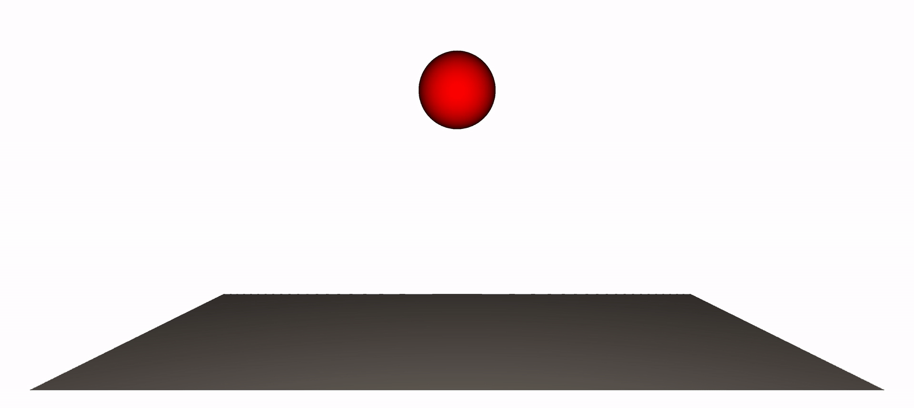

[](https://opensource.org/licenses/Apache-2.0)
# JAX-LaB: A Python-based, Accelerated, Differentiable Massively Parallel Lattice Boltzmann Library for Modeling Multiphase and Multiphysics Flows & Physics-Based Machine Learning

JAX-LaB is a fully differentiable, accelerated multiphysics and multiphase 2D/3D Lattice Boltzmann Method (LBM) Python library written in [JAX](https://github.com/google/jax) and it provides a unified workflow for forward and 
inverse modeling of multiphase flows. JAX-LaB is an extension of [XLB](https://github.com/Autodesk/XLB) and adds support multiphase and multiphysics flows to the original library.

## Showcase
<!-- <p align="center">
  
</p>
<p align="center" width="300">
  Capillary fingering in a channel (multi-component simulation)
</p>
<p align="center">
  
</p>
<p align="center" width="300">
  Capillary rise in parallel plates (single component, multiphase simulation)
</p> -->
<p align="center">
  
</p>
<p align="center">
    Time evolution of liquid distribution in a porous medium during evaporation. Two-component (air–water) system simulated with the Cascaded (central-moment) collision model.
</p>
<p align="center">
  
</p>
<p align="center">
  On GPU in-situ rendering using <a href="https://github.com/loliverhennigh/PhantomGaze">PhantomGaze</a> library (no I/O). Droplet impact on dry surface using MRT collision model with ~16 million cells.
  (single component, multiphase simulation, density ratio: 350, fluid modeled using Peng-Robinson EOS).
</p>
<p align="center">
  
</p>
<p align="center">
  In-situ GPU rendering of drainage in a porous geometry. BGK collision model, 110 million cells.
</p>
<p align="center">
  
</p>
<p align="center">
<a href=https://www.epc.ed.tum.de/en/aer/research-groups/automotive/drivaer > DrivAer model </a> in a wind-tunnel using KBC Lattice Boltzmann Simulation with approx. 317 million cells
</p>

<p align="center">
  
</p>
<p align="center">
  Airflow in to, out of, and within a building (~400 million cells)
</p>

<p align="center">
  
</p>
<p align="center">
The stages of a fluid density field from an initial state to the emergence of the "XLB" pattern through deep learning optimization at timestep 200 (see paper for details)
</p>

<br>

## Key Features
- **Integration with JAX Ecosystem:** The library can be easily integrated with JAX's robust ecosystem of machine learning libraries such as [Flax](https://github.com/google/flax), [Haiku](https://github.com/deepmind/dm-haiku), [Optax](https://github.com/deepmind/optax), and many more.
- **Differentiable LBM Kernels:** JAX-LaB provides differentiable LBM kernels that can be used in differentiable physics and deep learning applications.
- **Scalability:** JAX-LaB is capable of scaling on distributed multi-GPU systems, enabling the execution of large-scale simulations on hundreds of GPUs with billions of cells.
- **Support for Various LBM Boundary Conditions and Kernels:** JAX-LaB supports several LBM boundary conditions and collision kernels.
- **Support for Multiphase, Multiphysics and Multicomponent flows**: JAX-LaB can accurately model multiphysics and multiphase flows using Shan-Chen method, simulating complex interface dynamics without tracking any interface.
- **User-Friendly Interface:** Written entirely in Python, JAX-LaB emphasizes a highly accessible interface that allows users to extend the library with ease and quickly set up and run new simulations.
- **Leverages JAX Array and Shardmap:** The library incorporates the new JAX array unified array type and JAX shardmap, providing users with a numpy-like interface. This allows users to focus solely on the semantics, leaving performance optimizations to the compiler.
- **Platform Versatility:** The same JAX-LaB code can be executed on a variety of platforms including multi-core CPUs, single or multi-GPU systems, TPUs, and it also supports distributed runs on multi-GPU systems or TPU Pod slices.
- **Visualization:** JAX-LaB provides a variety of visualization options including in-situ on GPU rendering using [PhantomGaze](https://github.com/loliverhennigh/PhantomGaze).

## Capabilities
### Multiphase Flow Modeling
**Shan-Chen** pseudopotential method with various modifications:
- Support for **high density ratio flows** (tested for density ratios > 10^8) using improved forcing scheme.
- Incorporates **Equation of State (EOS)** to model multiphase flows. Currently implemented EOS include **Carnahan-Starling**, **Peng-Robinson**, **Redlich-Kwong**, **Redlich-Kwong-Soave**
and **VanderWaals**.
- **Density ratio independent surface tension** control by directly modifying pressure tensor.
- **Improved wetting scheme** to handle large range of contact angles ($5 - 170^\circ$) **without large spurious current or thick layers near solid surface**.
### Multicomponent Flow Support
JAX-LaB takes advantage of *pytrees* for computation hence, it can **model any number of components** (each with their own equation of state, initial condition and boundary conditions) without any 
user modification.

## Wetting model
- Wetting behavior of fluids is modeled using the [improved virtual density scheme](https://journals.aps.org/pre/abstract/10.1103/PhysRevE.100.053313) which avoids the need to include separate fluid-solid interaction forces commonly seen in Shan-Chen method by directly updating the near-wall densities
- Wetting parameters can be passed by user while defining wall boundary conditions. 

### Collision Models
- **BGK**
- **Multi-Relaxation Time (MRT)**
- **Cascaded Model**
- **KBC**

### Lattice
- D2Q9
- D3Q19
- D3Q27

### Machine Learning

- Easy integration with JAX's ecosystem of machine learning libraries
- Differentiable LBM kernels both for single and multiphase flows
- Differentiable boundary conditions

### Compute Capabilities
- Distributed Multi-GPU support
- Mixed-Precision support (store vs compute)
- Out-of-core support (coming soon)

### Output

- Binary and ASCII VTK output (based on PyVista library)
- In-situ rendering using [PhantomGaze](https://github.com/loliverhennigh/PhantomGaze) library
- [Orbax](https://github.com/google/orbax)-based distributed asynchronous checkpointing
- Image Output
- 3D mesh voxelizer using trimesh

### Boundary conditions

- **Equilibrium BC:** In this boundary condition, the fluid populations are assumed to be in at equilibrium. Can be used to set prescribed velocity or pressure.

- **Full-Way Bounceback BC:** In this boundary condition, the velocity of the fluid populations is reflected back to the fluid side of the boundary, resulting in zero fluid velocity at the boundary.

- **Half-Way Bounceback BC:** Similar to the Full-Way Bounceback BC, in this boundary condition, the velocity of the fluid populations is partially reflected back to the fluid side of the boundary, resulting in a non-zero fluid velocity at the boundary.

- **Do Nothing BC:** In this boundary condition, the fluid populations are allowed to pass through the boundary without any reflection or modification.

- **Zouhe BC:** This boundary condition is used to impose a prescribed velocity or pressure profile at the boundary.
- **Regularized BC:** This boundary condition is used to impose a prescribed velocity or pressure profile at the boundary. This BC is more stable than Zouhe BC, but computationally more expensive.
- **Extrapolation Outflow BC:** A type of outflow boundary condition that uses extrapolation to avoid strong wave reflections.

- **Interpolated Bounceback BC:** Interpolated bounce-back boundary condition due to Bouzidi for a lattice Boltzmann method simulation.

- **Convective Outflow BC**: Convective outflow boundary condition, useful for porous media flows.

## Accompanying Paper
A preprint of the paper submitted to the Journal of Advances in Modeling Earth Systems (JAMES), presenting an overview of JAX-LaB is available on [arXiv](https://arxiv.org/abs/2506.17713).

<!-- ## Citing XLB

If you use XLB in your research, please cite the following paper:

```
@article{ataei2024xlb,
  title={{XLB}: A differentiable massively parallel lattice {Boltzmann} library in {Python}},
  author={Ataei, Mohammadmehdi and Salehipour, Hesam},
  journal={Computer Physics Communications},
  volume={300},
  pages={109187},
  year={2024},
  publisher={Elsevier}
}
``` -->

## Installation Guide

To use JAX-LaB, you must first install JAX and other dependencies using the following commands:


Please refer to https://github.com/google/jax for the latest installation documentation. The following table is taken from [JAX's Github page](https://github.com/google/jax).

| Hardware   | Instructions                                                                                                    |
|------------|-----------------------------------------------------------------------------------------------------------------|
| CPU        | `pip install -U "jax[cpu]"`                                                                                       |
| NVIDIA GPU on x86_64 | `pip install -U "jax[cuda12_pip]" -f https://storage.googleapis.com/jax-releases/jax_cuda_releases.html`        |
| Google TPU | `pip install -U "jax[tpu]" -f https://storage.googleapis.com/jax-releases/libtpu_releases.html`                 |
| AMD GPU    | Use [Docker](https://hub.docker.com/r/rocm/jax) or [build from source](https://jax.readthedocs.io/en/latest/developer.html#additional-notes-for-building-a-rocm-jaxlib-for-amd-gpus). |
| Apple GPU  | Follow [Apple's instructions](https://developer.apple.com/metal/jax/).                                          |

**Note:** We encountered challenges when executing XLB on Apple GPUs due to the lack of support for certain operations in the Metal backend. We advise using the CPU backend on Mac OS. We will be testing XLB on Apple's GPUs in the future and will update this section accordingly.


Install dependencies:
```bash
pip install pyvista numpy matplotlib Rtree trimesh jmp orbax-checkpoint termcolor
```

Run an example:
```bash
git clone https://github.com/piyush-ppradhan/JAX-LaB
cd JAX-LaB
export PYTHONPATH=.
python3 examples/singlephase/cavity2d.py
```
## Roadmap

### Work in Progress (WIP)
*Note: Some of the work-in-progress features can be found in the branches of the XLB repository. For contributions to these features, please reach out.*

- 🚀 **Warp Backend:** Achieving state-of-the-art performance by leveraging the [Warp](https://github.com/NVIDIA/warp) framework in combination with JAX.

 - 🌐 **Grid Refinement:** Implementing adaptive mesh refinement techniques for enhanced simulation accuracy.

- ⚡ **Multi-GPU Acceleration using [Neon](https://github.com/Autodesk/Neon) + Warp:** Using Neon's data structure for improved scaling.

- 🗜️ **GPU Accelerated Lossless Compression and Decompression**: Implementing high-performance lossless compression and decompression techniques for larger-scale simulations and improved performance.

- 🌡️ **Fluid-Thermal Simulation Capabilities:** Incorporating heat transfer and thermal effects into fluid simulations.

- 🎯 **Adjoint-based Shape and Topology Optimization:** Implementing gradient-based optimization techniques for design optimization.

- 🧠 **Machine Learning Accelerated Simulations:** Leveraging machine learning to speed up simulations and improve accuracy.

- 📉 **Reduced Order Modeling using Machine Learning:** Developing data-driven reduced-order models for efficient and accurate simulations.


<!-- ### Wishlist
*Contributions to these features are welcome. Please submit PRs for the Wishlist items.*

- 🌊 **Free Surface Flows:** Simulating flows with free surfaces, such as water waves and droplets.

- 📡 **Electromagnetic Wave Propagation:** Simulating the propagation of electromagnetic waves.

- 🛩️ **Supersonic Flows:** Simulating supersonic flows.

- 🌊🧱 **Fluid-Solid Interaction:** Modeling the interaction between fluids and solid objects.

- 🧩 **Multiphase Flow Simulation:** Simulating flows with multiple immiscible fluids.

- 🔥 **Combustion:** Simulating combustion processes and reactive flows.

- 🪨 **Particle Flows and Discrete Element Method:** Incorporating particle-based methods for granular and particulate flows.

- 🔧 **Better Geometry Processing Pipelines:** Improving the handling and preprocessing of complex geometries for simulations. -->

